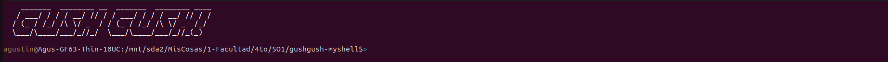
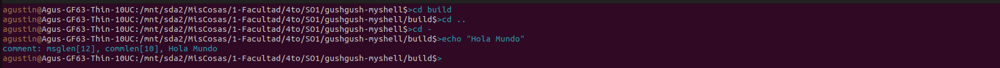
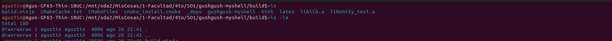
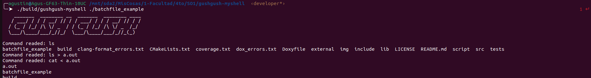
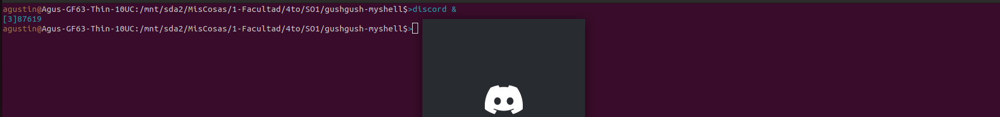
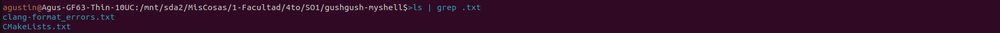
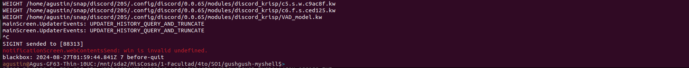

# MyShell basic

### SOI - FCEFyN - UNC - 2022

## Objetive
The development of this Practical Work:

- Utilize process creation mechanisms.
- Utilize concurrency and IPC mechanisms.
- Design a command-line interpreter in the style of the Bourne shell.

## Introduction
This practical work consists of developing a program in the C language on GNU/Linux. The work is divided into incremental solutions.

## Activities
### 1. Command line prompt
_myshell_ should have a prompt that displays the current directory path.

For example, home: _username@hostname:~$_


### 2. Internal commands
_myshell_ should support the following internal commands:

> __cd \<directory\>__ : changes the current directory to \<directory\>. If \<directory\> is not provided, it reports the current directory. If the directory does not exist, an appropriate error should be printed. Additionally, this command should update the PWD environment variable.
This command should support the *cd -* option, which returns to the last working directory (__OLDPWD__).

> __clr__: clears the screen.

> __echo \<comment\|env var\>__ : displays \<comment\> on the screen followed by a new line. (multiple spaces/tabs may be reduced to a single space).

> __quit__ : exits myshell.



### 3. Program invocation
User inputs that are not internal commands should be interpreted as invoking a program. This should be done using __fork__ and __execl__. It must also support both relative and absolute paths.




### 4. Executing Instructions from a Text File
To execute a set of instructions from a text file, the file should be passed as a parameter when running MyShell, as follows:
```bash
./bin/myshell batchfile           
```
Where batchfile refers to the text file you want to read. There should be one instruction per line.

After executing the instructions, MyShell will terminate.

A sample batchfile is provided as an example.



### 5. Background execution
An ampersand & at the end of the command line indicates that the shell should return to the prompt immediately after launching the program to be executed in the background.

When a background job is started, a message should be printed indicating its Job and Process ID.
`[<job id>] <process id>`

Example:
`$ echo 'Hello World' &
[1] 10506
hola`



### 6. Support for Commands ctrl-c, ctrl-z y ctrl-|
You can enter any of these key combinations to abort or pause processes running in MyShell.


### 7. Pipes
The use of pipes (the | character) is supported to "chain processes," using the stdout of one as the stdin of the next, and so on. For example:
```bash
ls | grep .txt           
```
The command "ls" will be executed, and its output will be sent to the grep command as input. In this example, the grep command will filter the files that contain the string ".txt" from the items listed by "ls".



### 8. Input and Output Redirection
You can redirect the input, output, or both of a program. By default, a program’s input is taken from characters typed by the user, and the terminal is the output. With this functionality, we can change this behavior, allowing a program to take input from a file, for example, or directing it to write its output to a file. For example:
```bash
ls > outputfile.txt          
```
This will direct the results of the "ls" command to a file named outputfile.txt. If the file does not exist, it will be created. If the file already contains text, it will be overwritten. For input redirection, the specified input file must exist; otherwise, the command will be invalid.



### ¿Dónde se encuentran los pipes en el filesystem, qué atributos tienen?
Los pipes no se encuentran en el filesystem que se encuentran los demás binarios, ya que se encuentra en otro filesystem "propio" virtual. Este filesystem virtual se llama PipeFS. Se encuentra montado en el kernel. A diferencia de otros filesystems que están montados bajo "/", este se encuentra montado en "pipe", es decir que tiene su propio directorio root. La entrada a este fylesistem es la llamada al sistema "pipe()". Este filesystem no puede ser visto por los usuarios, y es un sisteama de archivos en memoria.
